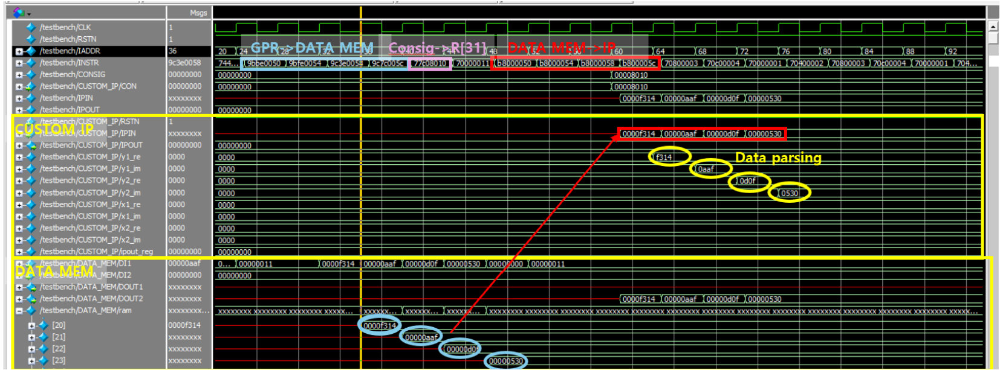
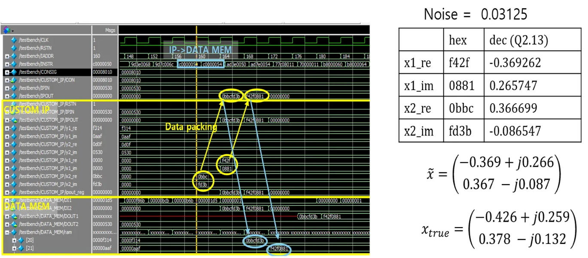

# RISC-V 5-stage pipeline processor + 2×2 MMSE MIMO hardware accelerator

커스텀 ISA 기반 5단계 파이프라인 RISC 프로세서를 Verilog로 설계하고, 2×2 MMSE MIMO 수신기를 하드웨어 IP로 구현해 커스텀 명령어(LDIP/STIP)로 CPU에 연동한 디지털 회로 설계 프로젝트.


---

## 프로젝트 배경

MIMO(Multiple-Input Multiple-Output)는 현대 무선통신의 핵심 기술로, 복수 안테나로 동시에 서로 다른 데이터 스트림을 전송해 채널 용량을 극대화한다. 수신 측에서는 채널 간 간섭을 제거하기 위한 MMSE(Minimum Mean Square Error) 수신기 연산이 필요한데, 이 연산은 **행렬 역산**을 포함해 소프트웨어로 실행하면 매우 느리다.

이 프로젝트는 두 가지를 동시에 구현하였다.
1. **RISC 프로세서 설계** — 커스텀 ISA를 지원하는 5단계 파이프라인 CPU
2. **MMSE MIMO 하드웨어 가속기** — 고정소수점 Verilog IP로 구현, CPU와 커스텀 명령어로 연동

---

## 시스템 구조

```
┌─────────────────────────────────────────────────────┐
│                   RISC_TOY (CPU)                    │
│  IF → ID → EX → MEM → WB  (5단계 파이프라인)        │
│  커스텀 ISA 25종  |  해저드 유닛  |  포워딩 유닛      │
│                                                     │
│  LDIP 명령어 → CUSTOM_IP에 데이터 전달              │
│  STIP 명령어 ← CUSTOM_IP 결과 회수                 │
└──────────────────┬──────────────────────────────────┘
                   │ IPIN / IPOUT / CON (CONSIG)
┌──────────────────▼──────────────────────────────────┐
│              CUSTOM_IP (MMSE MIMO 가속기)            │
│  입력: y1, y2 (수신 복소 벡터, Q2.13)              │
│  처리: LDL^H 분해 → 전진/후진 대입 → MMSE 검출     │
│  출력: x1, x2 (복호 심볼, Q2.13)                  │
└─────────────────────────────────────────────────────┘
```

---

## 본인 기여

2인 팀 프로젝트에서 **CUSTOM_IP(MMSE MIMO 가속기) 전담 및 CPU-IP 연동 구현**, RISC_TOY 5단계 파이프라인도 함께 작업.

### RISC_TOY 프로세서 설계 (`RISC_TOY.v`)

커스텀 ISA(25종 명령어)를 지원하는 5단계 파이프라인 프로세서 설계.

- **파이프라인 레지스터**: `flopr` 모듈로 IF/ID, ID/EX, EX/MEM, MEM/WB 경계를 명확히 분리
- **데이터 해저드 처리**: EX→EX, MEM→EX 포워딩과 load-use 스톨을 `HazardUnit`에서 통합 관리
- **제어 해저드 처리**: 분기/점프 결과를 EX 단계에서 판정 후 IF 단계 플러시
- **커스텀 IP 인터페이스**: `LDIP`(데이터 전달), `STIP`(결과 회수) 명령어 추가, R[31] 레지스터를 CONSIG 제어 신호로 활용
- **ISA 전수 검증**: 커스텀 ISA 25종 명령어의 opcode와 피연산자를 이진수/16진수로 직접 인코딩해 `inst.hex`에 수동 작성, 명령어 하나씩 ModelSim에서 시뮬레이션하며 디코더 출력, 레지스터 갱신, 메모리 접근 타이밍을 파형으로 확인. 즉각 피연산자 부호 확장 오류, 분기 오프셋 계산 버그 등을 파형에서 직접 발견하고 디코더/제어 경로를 수정해 전체 명령어 셋 통과

### 2×2 MMSE MIMO IP 설계 (`CUSTOM_IP.v`)

MMSE 수신기를 고정소수점 Verilog로 구현.

**알고리즘**: LDL^H 분해를 이용한 MMSE 검출

```
MMSE 필터: W = (H^H H + σ²I)^(-1) H^H

계산 순서:
  1. G = H^H H               (그람 행렬)
  2. A = G + σ²I             (MMSE 정규화)
  3. LDL^H(A) 분해           (행렬 역산 대신 분해로 계산)
  4. b = H^H y               (매칭 필터 출력)
  5. 전진 대입 → 후진 대입    (Ly=b → L^H x=D^(-1)y 순서로 풀기)
```

- **고정소수점 설계**: 내부 연산 Q4.26 (48bit), I/O Q2.13 (16bit), 스케일 정렬 및 포화(saturation) 처리
- **하드웨어 나눗셈**: Newton-Raphson 반복법(2회 반복)으로 역수 계산, 32-entry LUT로 초기값 근사
- **FSM 제어**: 10개 상태로 순차 연산 파이프라인 구성
- **병렬 역수 계산**: d11, d22 두 대각 원소 역수를 `inverse_opt` 모듈 2개로 동시 계산

---

## 기술적 문제 해결

### 1. 하드웨어 나눗셈 구현

FPGA에는 나눗셈 하드웨어가 없어 MMSE 연산에 필요한 역수($\frac{1}{d_{ii}}$)를 직접 구현해야 하는 문제.  
→ Newton-Raphson 반복법(`x_{n+1} = x_n(2 - d*x_n)`)을 2회 적용하고 32-entry LUT로 초기값을 근사해 빠르게 수렴. Q4.26 고정소수점에서 2회 반복으로 충분한 정밀도 확보.

### 2. 고정소수점 오버플로우 vs 정밀도 트레이드오프

Q2.13 입력을 그대로 내부 곱셈에 쓰면 누적 오차가 커지고, 비트를 너무 많이 쓰면 오버플로우 발생.  
→ 입력/출력은 Q2.13(16bit), 내부 중간 연산은 Q4.26(48bit)으로 확장하고 각 단계 결과를 다음 연산 전에 스케일 정렬 후 포화 처리해 오버플로우 방지.

### 3. CPU-IP 연동 타이밍

CPU의 LDIP 명령이 데이터를 전달하면 IP가 연산을 완료하기 전에 STIP가 실행될 위험.  
→ R[31] 레지스터를 CONSIG 신호로 활용해 IP가 완료 신호를 CPU에 반환할 때까지 대기하는 핸드셰이크 구현.

### 4. 해저드 처리 — load-use 스톨

로드 명령 직후 결과를 사용하는 명령이 오면 WB 완료 전에 EX에서 값을 읽어 잘못된 데이터 사용.  
→ `HazardUnit`에서 load-use 패턴을 탐지해 1사이클 스톨을 삽입하고 EX/MEM 포워딩으로 나머지 해저드 처리.

---

## RISC-TOY ISA

| 구분 | 명령어 |
|:---|:---|
| 산술 | ADD, ADDI, SUB, NEG |
| 논리 | AND, ANDI, OR, ORI, XOR, NOT |
| 시프트 | LSR, ASR, SHL, ROR |
| 이동 | MOVI |
| 분기/점프 | J, JL, BR, BRL (6가지 조건) |
| 메모리 | LD, LDR, ST, STR |
| IP 인터페이스 | **LDIP, STIP** |

---

## 시뮬레이션 결과

<p align="center">
  
  <br>
  <sub>입력 단계 — 수신 벡터 y(y1_re/im, y2_re/im)를 DATA_MEM에서 CUSTOM_IP로 적재 및 파싱</sub>
</p>

<p align="center">
  
  <br>
  <sub>출력 단계 — MMSE 연산 결과 x̂ 회수 후 DATA_MEM 저장, 실제값 x_true와 Q2.13 정밀도 내 일치 확인</sub>
</p>

ModelSim 파형에서 수신 벡터 y 적재부터 CUSTOM_IP의 MMSE 검출, 결과 x̂ 출력까지 전체 동작을 검증. 추정값 x̂와 실제값 x_true의 오차가 Q2.13 정밀도 수준임을 확인.

---

## 기술 스택

| 분류 | 사용 기술 |
|:---|:---|
| 하드웨어 기술 언어 | Verilog HDL |
| 합성/구현 도구 | Intel Quartus II |
| 시뮬레이션 | ModelSim |
| 수치 표현 | 고정소수점 (Q4.26 내부 / Q2.13 I/O) |
| 역수 알고리즘 | Newton-Raphson 반복법 + 32-entry LUT |

---

## 소스 코드 구조

```
src/
├── RISC_TOY.v          # 5단계 파이프라인 CPU (Datapath + Controller + HazardUnit + ALU)
├── CUSTOM_IP.v         # 2×2 MMSE MIMO IP + Newton-Raphson 역수 모듈 + LUT
├── model.v             # 메모리 모델 (INST_RAM, DATA_RAM, REGFILE)
├── testbench.v         # CUSTOM_IP 단독 단위 테스트벤치
│                       #   → CPU·메모리 없이 CUSTOM_IP만 직접 구동
│                       #   → 입력: CON[15]=1 + IPIN 4사이클(y1_re/im, y2_re/im)
│                       #   → 출력: IPOUT에서 x2(1사이클) → x1(1사이클) 캡처 후 표시
│                       #   → TC1: y=[1+0j,1+0j] / TC2: y=[1+1j,0-1j] / TC3: noise≠0
│                       #   → LDL^H FSM + Newton-Raphson 완료까지 TC당 200클럭 대기
├── testbench_RISC.v    # CPU 단독 테스트벤치 (CUSTOM_IP 제외, 파이프라인·해저드 검증)
└── inst.hex            # MMSE 테스트 프로그램 (수동 인코딩 hex): H·y 적재 → LDIP → STIP
```

---

## 시뮬레이션 실행

`testbench.v`는 CUSTOM_IP만 단독으로 구동하는 단위 테스트. CPU와 메모리 없이 IPIN/CON 신호를 직접 제어해 세 가지 수신 벡터(y)로 MMSE 출력(x1, x2)을 검증한다.

ModelSim에서 아래 순서로 실행한다.

```tcl
vlog src/CUSTOM_IP.v src/testbench.v
vsim -t 1ps work.testbench
add wave -r /*
run 8000ns
```

입력 프로토콜: `CON[15]=1` 인가 후 IPIN에 y1_re → y1_im → y2_re → y2_im 순서로 4사이클 제공. CUSTOM_IP는 LDL^H 분해와 Newton-Raphson 역수 계산(2회)을 거쳐 약 50~100클럭 뒤 `IPOUT`에 x2(1클럭), x1(1클럭) 순으로 결과를 출력한다.

CPU + 전체 시스템 통합 시뮬레이션은 아래 명령으로 실행한다.

```tcl
vlog src/RISC_TOY.v src/CUSTOM_IP.v src/model.v src/testbench_RISC.v
vsim -t 1ps work.testbench_RISC
add wave -r /*
run 3000ns
```

Quartus II에서 `RISC_TOY.qpf`를 열어 합성 및 타이밍 분석 수행 가능.
